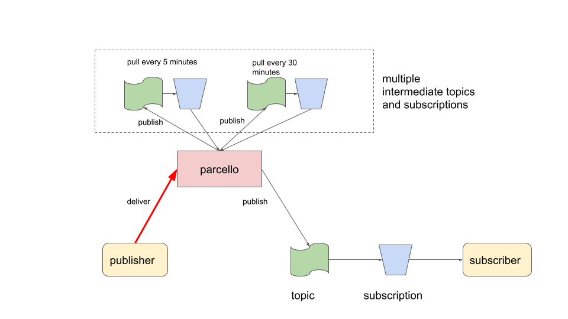
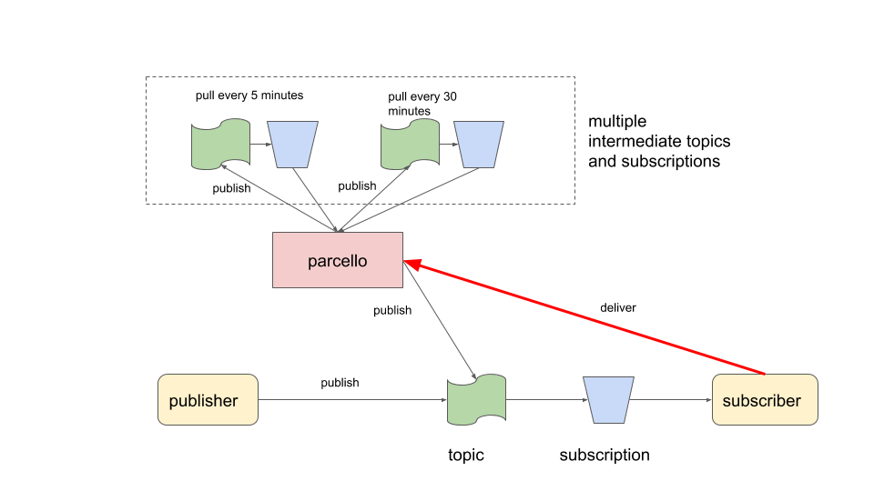

# parcello

Parcello is a delivery service on top of Google Pub Sub to publish messages with a time delay to a topic.
It uses multiple intermediate topic->subscriptions to queue such messages which are pulled (streaming) on computed time intervals.
These intermediate resources (topics, subscription) need to be created before deploying this service with the corresponding configuration.

## how does it work?

Instead of the publisher publishing to a topic, it sends a DeliverRequest to `parcello` specifying the time to delay the publish. 
The service will publish that request to one of its intermediary topics. 
Each such topic has its own listener (pulling messaging) at a time interval.
In this diagram, 2 such topics exists. One is pulled every 5 minutes. 
Each message is inspected to see whether it is about time to publish it to the actual destination topic.

For example, a message that need to be delivered after 8 minutes will be published to `parcello_5_minutes` once and to `parcello_1_minute ` 3 times.
Using a configuration, you can specify how many intermediary topics you need based on your estimations of the actual delay amounts.

In the next design, `parcello` is used to retry publishing a message at a later moment.
By passing the PublishCount into the retry DeliverRequest, a subscriber can inspect this value and behave accordingly (i.e abort on MaxRetries).

## usage

### api

This services uses gRPC for its API access.
The proto definition can be found in the /v1 folder.
In the example folder, you can see an example of a Go client implementation. Using `protoc` tools, you can generate a client for your programming language.

### server config

The `parcello` server configuration list one or more queues (intermediate topic+subscriptions).
This example show 2 such queues. 

    {
        "project":"YOUR GCP PROJECT",
        "queues": [{
                "topic": "parcello_1_minute",
                "subscription": "parcello_1_minute",
                "duration": "1m"
            },
            {
                "topic": "parcello_5_minutes",
                "subscription": "parcello_5_minutes",
                "duration": "5m"
            },
            {
                "topic": "parcello_30_minutes",
                "subscription": "parcello_30_minutes",
                "duration": "30m"
            }
        ]
    }

## build

    docker build -t parcello .

## run

    docker run -it \
        -v ~/.config/gcloud/:/gcloud \
        -e GOOGLE_APPLICATION_CREDENTIALS=/gcloud/application_default_credentials.json \
        parcello