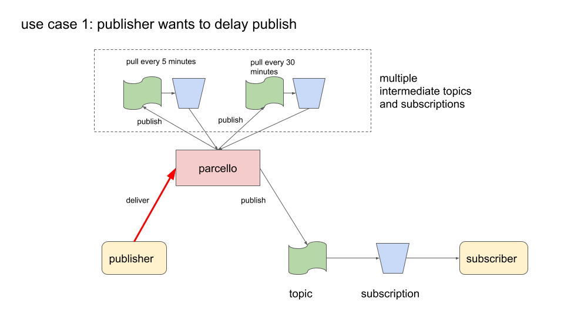
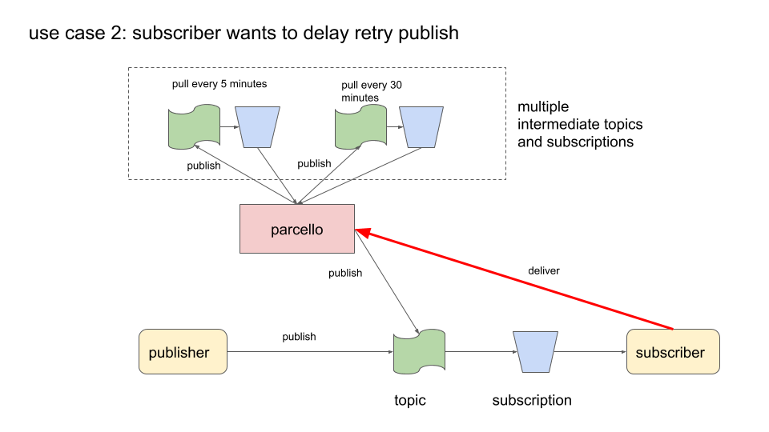

# parcello

Parcello is a delivery service on top of Google Pub Sub to publish messages with a time delay to a topic.
It uses multiple intermediate topic->subscriptions to queue such messages which are pulled (streaming) on computed time intervals.

## uscases

Instead of the publisher publishing to a topic, it send a DeliverRequest to parcello specifying the time to delay the publish. Parcello will publish that request in one of its intermediary topics. Each such topic has its own listener (pulling messaging) at a time interval. In this diagram, 2 such topics exists. One is pulled every 5 minutes. Each message is inspected to see whether it is about time to publish it to the actual destination topic.

## usage

### api

This services uses gRPC for its API access.
The proto definition can be found in the /v1 folder.
In the example folder, you can see an example of a Go client implementation.

### server config

    {
        "project":"YOUR GCP PROJECT",
        "queues": [{
                "topic": "parcello_1_minute",
                "subscription": "parcello_1_minute",
                "duration": "1m"
            },
            {
                "topic": "parcello_5_minutes",
                "subscription": "parcello_5_minutes",
                "duration": "5m"
            },
            {
                "topic": "parcello_30_minutes",
                "subscription": "parcello_30_minutes",
                "duration": "30m"
            }
        ]
    }

## example

### prepare infrastructure
 
    gcloud pubsub topics create parcello_destination
    gcloud pubsub topics create parcello_minute
    gcloud pubsub topics create parcello_five_minutes

and the subscriptions

    gcloud pubsub subscriptions create parcello_destination  --topic parcello_destination --topic-project philemonworks
    gcloud pubsub subscriptions create parcello_minute       --topic parcello_minute      --topic-project philemonworks
    gcloud pubsub subscriptions create parcello_five_minutes --topic parcello_five_minutes --topic-project philemonworks

### start the server    

    go run *.go

### running the example

    cd test && go run *.go

### pull from destination

    gcloud pubsub subscriptions pull --auto-ack parcello_destination
